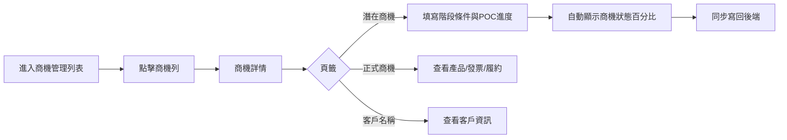
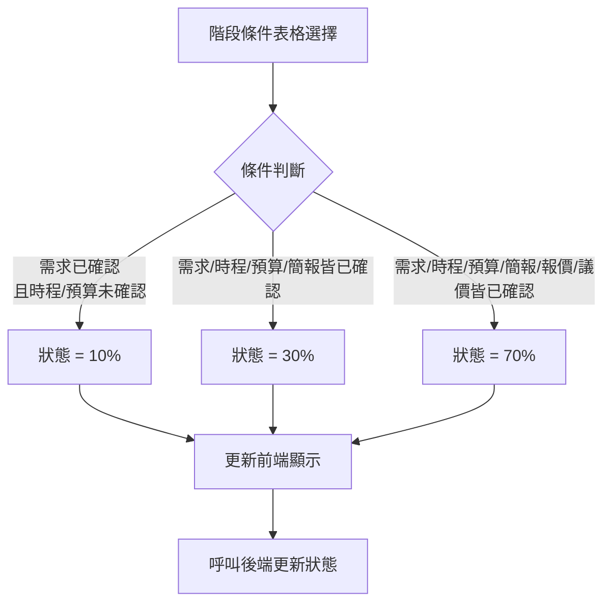

# 商機管理 - 規格

## 目標
- 商機狀態由階段條件表格的選擇結果推導並同步回後端。
- 提供潛在商機、正式商機、客戶名稱三個頁籤，清晰區分開發階段與正式資料。
- 在頁面上提供 POC 進度與原因紀錄，並保留輸入內容。

## 入口與範圍
- 入口：側邊欄「商機管理」
- 主要頁面：
  - 列表：`FrontEnd/manager-back-site/src/views/crm/pipeline/pipeline/CrmPipelinePipelineList.vue`
  - 詳情：`FrontEnd/manager-back-site/src/views/crm/pipeline/pipeline/CrmPipelinePipelineDetail.vue`

## 資料與狀態
- 商機狀態依「階段條件紀錄」表格的選擇結果產生（10% / 30% / 70%）。
- POC 進度與原因紀錄採 localStorage 保存（依 pipelineId）。
- 商機狀態變更後會呼叫後端更新。

## UI 結構
### 基本資訊區塊
- 「商機狀態」改為進度條呈現，顯示百分比與文字。
- 狀態來源：階段條件表格選擇結果。

### 頁籤
- 潛在商機：階段條件紀錄 + POC 進度
- 正式商機：窗口、產品、發票、履約
- 客戶名稱：客戶資訊

### 階段條件紀錄
- 10/30/70 條件說明收合在標題內點開查看。
- 條件改為表格顯示：條件 / 狀態 / 說明 / 備註
- 不顯示「需達到：商機xx%」文字。

### POC 區塊
- 進程、追蹤待辦（業務/工程部填寫）
- 結果：會下單 / 不會下單
- 不會下單原因：工程師技術不到位 / 業務溝通問題 / 產品功能不符合需求 / 其他（可輸入）

## 商機狀態判斷規則
- 10%：需求確認 = 已確認，且時程 / 預算均非已確認。
- 30%：需求 / 時程 / 預算 / 簡報皆已確認。
- 70%：需求 / 時程 / 預算 / 簡報 / 報價 / 議價皆已確認。

## User Flow


## Flow Chart


## 後端邏輯
- 狀態更新：`POST /api/MbsCrmPipeline/UpdatePipelineStatus`
  - 請求包含商機狀態與階段條件欄位。
- 商機詳情：`POST /api/MbsCrmPipeline/GetEmployeePipeline`
- 商機列表：`POST /api/MbsCrmPipeline/GetManyEmployeePipeline`

## API 欄位定義（Request / Response）

### 1) 取得商機列表
**Endpoint**: `POST /api/MbsCrmPipeline/GetManyEmployeePipeline`  
**Request (HTTP)**  
```json
{
  "employeeLoginToken": "string",
  "atomPipelineStatus": 6,
  "managerCompanyName": "string",
  "pageIndex": 1,
  "pageSize": 10
}
```
**Response (HTTP)**  
```json
{
  "errorCode": 1,
  "employeePipelineList": [
    {
      "employeePipelineID": 123,
      "atomPipelineStatus": 7,
      "managerCompanyName": "台積電",
      "contacterDepartment": "資訊部",
      "contacterJobTitle": "經理",
      "contacterName": "王小明",
      "contacterEmail": "example@company.com",
      "contacterPhone": "0912-345-678",
      "contacterTelephone": "02-1234-5678",
      "employeePipelineSalerEmployeeName": "林家豪"
    }
  ],
  "totalCount": 1
}
```

### 2) 取得商機詳情
**Endpoint**: `POST /api/MbsCrmPipeline/GetEmployeePipeline`  
**Request (HTTP)**  
```json
{
  "employeeLoginToken": "string",
  "employeePipelineID": 123
}
```
**Response (HTTP)**  
```json
{
  "errorCode": 1,
  "atomPipelineStatus": 7,
  "employeePipelineSalerEmployeeID": 1001,
  "employeePipelineSalerEmployeeName": "林家豪",
  "employeePipelineSalerRegionID": 1,
  "employeePipelineSalerRegionName": "北區",
  "employeePipelineSalerDepartmentID": 1,
  "employeePipelineSalerDepartmentName": "業務部",
  "company": {
    "managerCompanyUnifiedNumber": "12345678",
    "managerCompanyID": 100,
    "managerCompanyName": "台積電",
    "atomEmployeeRange": 1,
    "atomCustomerGrade": 1,
    "managerCompanyMainKindName": "一般企業",
    "managerCompanySubKindName": "科技業",
    "atomCity": 1,
    "managerCompanyLocationID": 1,
    "managerCompanyLocationAddress": "台北市信義區松仁路100號",
    "managerCompanyLocationTelephone": "02-2345-6789",
    "managerCompanyLocationStatus": 1
  },
  "contacterList": [
    {
      "managerContacterID": 1,
      "employeePipelineContacterIsPrimary": true,
      "managerContacterName": "王小明",
      "managerContacterEmail": "example@company.com",
      "managerContacterPhone": "0912-345-678",
      "managerContacterDepartment": "資訊部",
      "managerContacterJobTitle": "經理",
      "managerContacterTelephone": "02-1234-5678",
      "managerContacterIsConsent": true,
      "managerContacterStatus": 1,
      "atomRatingKind": 1,
      "managerContacterRemark": "備註"
    }
  ],
  "pendingEmployeePipelineSaler": null,
  "employeePipelineSalerList": [],
  "employeePipelineSalerTrackingList": [],
  "employeePipelineProductList": [],
  "employeePipelineDueList": [],
  "employeePipelineBillList": [],
  "stageStatus": {
    "businessNeedStatus": 2,
    "businessTimelineStatus": 1,
    "businessBudgetStatus": 1,
    "businessPresentationStatus": 1,
    "businessQuotationStatus": 1,
    "businessNegotiationStatus": 1,
    "businessStageRemark": "備註"
  }
}
```

### 3) 更新商機狀態（同步寫回）
**Endpoint**: `POST /api/MbsCrmPipeline/UpdatePipelineStatus`  
**Request (HTTP)**  
```json
{
  "employeeLoginToken": "string",
  "employeePipelineID": 123,
  "atomPipelineStatus": 7,
  "businessNeedStatus": 2,
  "businessTimelineStatus": 1,
  "businessBudgetStatus": 1,
  "businessPresentationStatus": 2,
  "businessQuotationStatus": 1,
  "businessNegotiationStatus": 1,
  "businessStageRemark": "備註"
}
```
**Response (HTTP)**  
```json
{
  "errorCode": 1
}
```

## 相關檔案
- 詳情頁：`FrontEnd/manager-back-site/src/views/crm/pipeline/pipeline/CrmPipelinePipelineDetail.vue`
- 基本資訊區塊：`FrontEnd/manager-back-site/src/views/crm/pipeline/pipeline/components/sections/PipelineBasicInfoSection.vue`
- 服務層：`FrontEnd/manager-back-site/src/services/pms-http/crm/pipeline/crmPipelineHttpService.ts`
