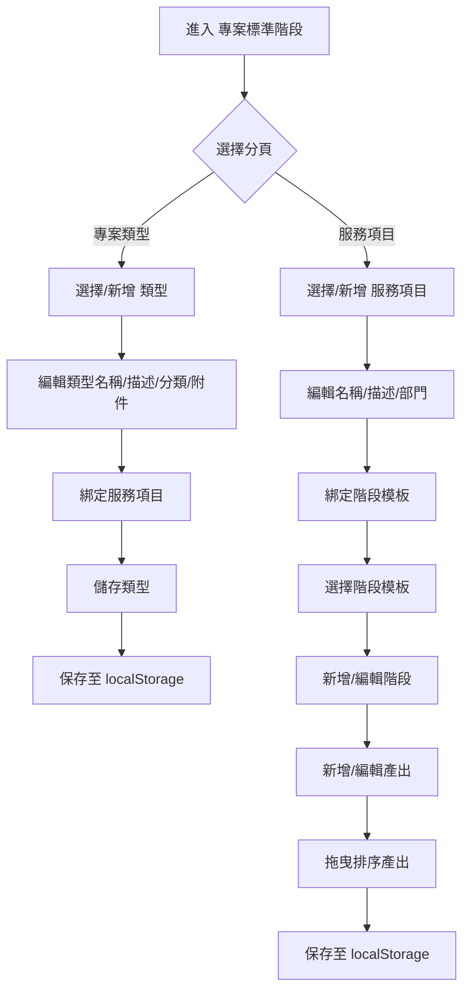
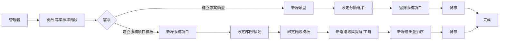

專案標準階段 - 規格

## 目標

提供系統管理者在前端獨立維護「專案標準階段」資料，包括：

- 專案類型（Project Types）
- 服務項目（Service Items）
- 標準階段與產出（Stage Templates / Outputs）
- 提醒與工時/人天估算設定

## 入口與範圍

- 側邊欄「專案標準階段」入口。
- 對應畫面：`FrontEnd/manager-back-site/src/views/system/project-template/SystemProjectTemplateSettings.vue`。

## 資料來源與保存

- 讀取：`loadProjectTemplateSettings()`。
- 寫入：`saveProjectTemplateSettings()`。
- 儲存位置：localStorage（前端本地資料）。
- 每次新增/更新/拖曳排序後即保存。
- 變更時更新 `lastEditedBy` / `lastEditedAt`。

## 畫面結構與設計

### 頁首

- 無返回按鈕，內容由下方分頁主導。

### 分頁

- 兩個主分頁：
  - `專案類型`
  - `服務項目`

### 版面與風格

- 卡片式白底區塊、圓角與輕陰影。
- 表單欄位使用既有 `input-box` / `select-box` / `btn-*` 系列樣式。
- Stage 卡片使用淡灰底 (`bg-gray-50`) 與灰邊框，標籤使用淡色底小圓角。

## 功能與互動

### 1) 專案類型（Project Type）

- 功能
  - 新增 / 編輯專案類型。
  - 支援類型分類：`單一` / `混合`。
  - 綁定服務項目（單一僅允許 1 個）。
  - 設定合規附件需求（Order / SLA）。
- 邏輯
  - 單一類型：點選服務項目時僅保留 1 筆。
  - 儲存時需 `projectTypeName` 有值。
  - 新增時自動產生遞增 ID。
- UI
  - 左側列表：專案類型清單。
  - 右側：類型詳情與編輯表單。

### 2) 服務項目（Service Item）

- 功能
  - 新增 / 編輯服務項目。
  - 綁定階段模板（Stage Template）。
  - 顯示部門標籤、描述。
- 邏輯
  - 儲存時需 `serviceItemName` 有值。
  - 可切換選取的 Stage Template 進行編輯。

### 3) 階段模板（Stage Template）

- 功能
  - 編輯模板名稱、描述、部門標籤。
  - 管理階段（Stage）清單。
- 顯示
  - 顯示最後編輯者與時間：
    - `最後編輯者：{user}`
    - `最後編輯時間：{datetime}`（本機時間格式化）

### 4) 階段（Stage）管理

- 新增/編輯
  - `階段名稱`
  - `負責角色`（ownerRoleLabel）
  - 工作日誌 / 駐點打卡
  - 提醒天數（3/5/7）與基準（起日/迄日）
  - 預計人天/時數 + 必填
- 顯示
  - 顯示標籤（pill）
    - 需工作日誌 / 需駐點打卡
    - 提醒：X 天（起日/迄日）
    - 人天 / 時數（含必填提示）
- 行為
  - 新增與編輯使用同一組表單。
  - 儲存後更新模板最後編輯資訊並寫入 localStorage。

### 按鈕文案

- 「+新增標準階段」：服務項目標準階段設置區塊的主要新增按鈕。
- 「+新增階段與產出」：階段與產出清單下方的新增入口。

### 5) 產出（Output）管理

- 新增/編輯
  - 產出名稱
  - 產出類型：文件 / 會議 / 報告 / 其他
  - 自訂其他類型名稱（僅 `other` 顯示）
  - 必填設定
- 顯示
  - 顯示產出名稱與類型
  - 顯示必填 / 選填
- 行為
  - 新增後立即出現在清單中。
  - 清單永遠顯示（不因新增狀態消失）。
  - 支援拖曳排序（drag handle）。
- 拖曳後同步更新排序並保存。

## 專案命名與代號規則（草案）

### 專案名稱（自動產生）

- 條件：使用者完成「服務項目 + 產品」選擇並輸入客戶後自動產生。
- 組合建議：`{客戶名稱}-{服務項目}-{產品}`

### 專案代號（自動產生）

- 組合格式：`{產業別代碼}{區域代碼}{YYMMDD}{流水號(3碼)}`
- 產業別代碼（先行定義）
  - `TECH` 科技業
  - `FIN` 金融業
  - `MAN` 製造業
  - `MED` 醫療業
  - `GOV` 公部門
  - `EDU` 教育機構
  - `RET` 零售業
  - `LOG` 物流/運輸
  - `ENT` 其他
- 區域代碼（先行定義）
  - `A` 北區
  - `B` 中區
  - `C` 南區
- 備註：產業別與區域代碼可在後端對照表補齊後再微調，現階段僅提供前端組碼規則。

## 互動狀態與控制邏輯

- `isEditingProjectType` / `isEditingServiceItem` / `isEditingStageTemplate` 控制編輯模式。
- `isAddingStage` / `editingStageId` 控制階段新增/編輯狀態。
- `isAddingOutput` / `editingOutputId` 控制產出新增/編輯狀態。
- 點選不同 Service Item 時會重置階段/產出表單狀態。

## 拖曳排序

- 使用 `vuedraggable@next`。
- 產出拖曳時綁定 `handle` 為 `.drag-handle`。
- 拖曳完成後更新排序並保存。

## 錯誤與限制

- 空白名稱不允許儲存（保持原狀）。
- 未選取 Stage Template 時不顯示階段區塊。
- 本功能為前端本地資料，未與後端同步。

## 檔案與關聯

- UI：`FrontEnd/manager-back-site/src/views/system/project-template/SystemProjectTemplateSettings.vue`
- Store：`FrontEnd/manager-back-site/src/stores/projectTemplateSettings.ts`
- 規格擴充：`docs/specs/system_project_templates.md`

## Flowchart

## User Flowchart

